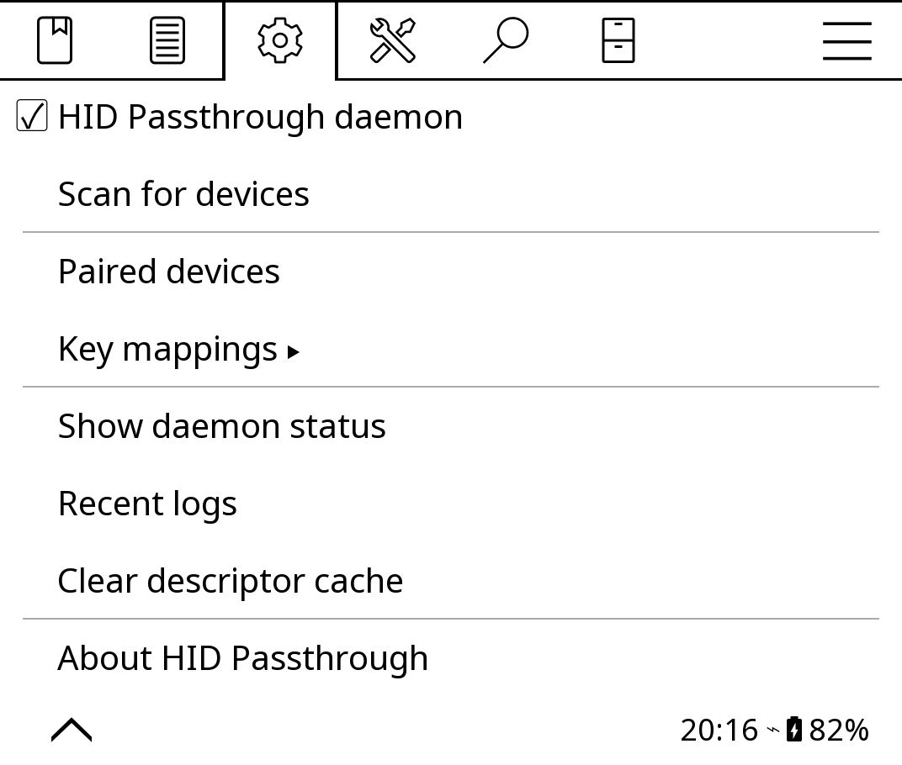
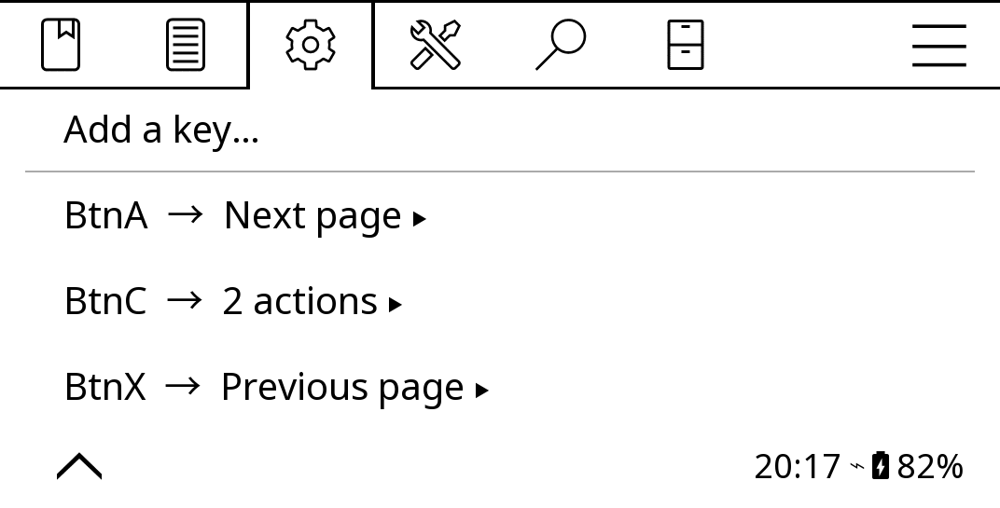
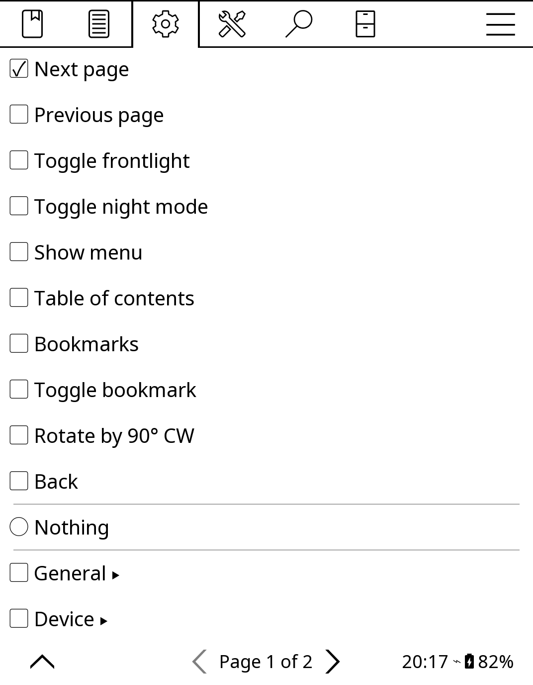

# KOReader Plugin: HID Passthrough

KOReader plugin that lets users start/stop the kindle-hid-passthrough Bluetooth HID daemon from within KOReader, and bind any key on a connected device to any KOReader action.

Originally created by [@alllexx88](https://github.com/alllexx88) (see [issue #40](https://github.com/zampierilucas/kindle-hid-passthrough/issues/40)).



## Features

Full feature parity with the BTManager WAF app — you can manage everything from inside KOReader, no need to exit.

- Adds a "BT Manager - HID Passthrough" entry under Settings > Network
- **Daemon control**: start / stop / toggle the HID daemon (also bindable to gestures via Dispatcher actions)
- **Scan for devices**: discovers nearby BLE and Classic HID devices, with live-updating results menu
- **Paired devices**: list paired devices with connect / disconnect / remove (forget) actions
- **Recent logs**: in-app log viewer with refresh, useful for debugging pairing issues
- **Clear descriptor cache**: drop cached HID descriptors
- **Daemon status**: version, configured devices, connected device, scanning / pairing flags
- **Key mappings**: bind any key on any connected device to any KOReader action

## Key mappings

**Settings → Network → BT Manager - HID Passthrough → Key mappings**

Tap "Add a key…", press the key you want to bind, then pick an action for it. Modifier combos work where KOReader reports the modifier, so `Shift+F5` is a distinct binding from `F5`.

<p align="center">
  
  
</p>

The action list opens on a short block of common ones — next/previous page, close, frontlight, night mode, menu, table of contents, bookmarks, rotate, back — because the full list runs to seven pages and the everyday bindings shouldn't need a hunt. Everything else is underneath, grouped exactly as KOReader groups it for gestures and profiles: anything you can bind to a gesture you can bind to a key.

To drop a mapping, hold its row in the list, or use "Remove this key" at the bottom of that key's action list.

Next page and Previous page are added by this plugin. Upstream only ships "Turn pages", which is a number you dial in from a −100..100 spinner; these are the fixed ±1 steps as one-tap actions. They also show up in the gesture manager, so they're usable outside this plugin too.

A key can run several actions at once — the entries are checkboxes, not radio buttons. That's Dispatcher behaviour, the same as gestures and profiles, and the last page of the action list has "Execute one by one" and "Show as QuickMenu" if you want a button to cycle or to offer a menu instead of firing everything.

Mappings are global — a key does the same thing in the reader and in the file browser — and live in `koreader/settings/hidpassthrough_keymap.lua`.

This runs entirely in-process. It does not use, and does not need, the HTTP Inspector plugin — unlike [kindle-button-mapper's](https://github.com/zampierilucas/kindle-button-mapper-rs) `scripts/koreader.sh`, which shells out to `curl` against `localhost:8080` for each press. Use button-mapper when you want mappings that work system-wide, outside KOReader; use this when you only care about KOReader.

Binding a key KOReader already uses for something (arrows, Enter, page-turn keys) is allowed, but whether your binding or the built-in behavior wins depends on event propagation order, so prefer keys the reader doesn't already claim. If a binding leaves you stuck, delete `koreader/settings/hidpassthrough_keymap.lua` and restart KOReader.

### Keys that KOReader normally ignores

KOReader drops key events whose scancode isn't in its input event map, which is why media keys, F13–F24 and gamepad buttons normally do nothing. `event_map_extra.lua` fills those gaps so they can be bound. It only ever adds codes KOReader left unset, so stock key behavior is untouched.

If a key still doesn't register when you try to bind it, it's likely being sent as a HID consumer-control usage the daemon isn't translating to an evdev key code. Check with:

```bash
ssh kindle "cat /proc/bus/input/devices"
just logs
```

### Gamepads

KOReader's `externalkeyboard` plugin only ever looks for keyboards, so a gamepad, which FBInk classifies as `JOYSTICK`, is never opened and its buttons reach nothing. This plugin opens those itself, so `BtnA` and friends become bindable like any other key.

Only the buttons. Sticks and the D-pad hat are `EV_ABS` and never become key events, so they can't be bound here. If you want those, that's what [kindle-button-mapper](https://github.com/zampierilucas/kindle-button-mapper-rs) is for.

## Requirements

KOReader 2026.07 "Sailing Walrus" or newer. Keyboards that connect while KOReader is running are picked up by KOReader's own `externalkeyboard` plugin, via the uevent input hot-plug support added in [koreader/koreader-base#2327](https://github.com/koreader/koreader-base/pull/2327) and [koreader/koreader#15248](https://github.com/koreader/koreader/pull/15248).

On older builds this plugin's daemon controls still work, but a keyboard connected after KOReader started won't be seen until you restart KOReader.

## Installation

Copy the `hidpassthrough.koplugin` directory to your KOReader plugins folder:

```
cp -r hidpassthrough.koplugin /mnt/us/koreader/plugins/
```

Then restart KOReader.

The kindle-hid-passthrough daemon must already be installed on the device at `/mnt/us/kindle_hid_passthrough/kindle-hid-passthrough`. See the main project README for installation instructions.

## Opening the menu

In KOReader, tap the top of the screen to bring up the menu bar, then:

**cog icon (Settings) → Network → BT Manager - HID Passthrough**

The sub-menu shows the daemon toggle, scan, paired devices and key mappings, with status, logs and cache tucked under Debug. Long-pressing the parent entry toggles the daemon without descending into the sub-menu.
